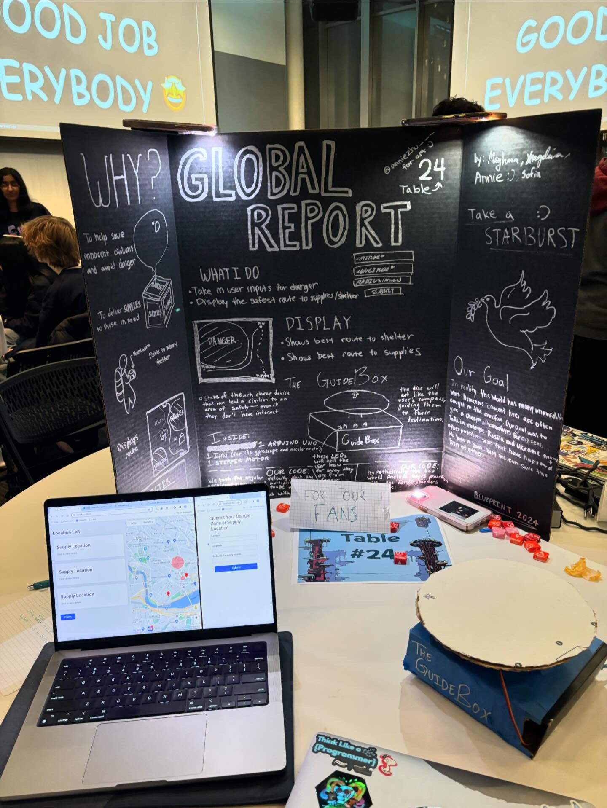

# Global Report
A website civilians can use to be aware of danger in their area. Created for MIT Blueprint 2024. 

**Track:** General

## Inspiration
The conflicts across the globe; recent, a long time ago, and in the future. We were inspired by times of unrest in the world. Whether it be natural disasters, a zombie apocalypse, or even a war, people need to be able to find resources in the most treacherous times. We wanted to make something that could help.

## What it does
The website takes in user inputs to create danger zones based off their location and radius. It also routes to the nearest shelter or supplies area based of the user. The guide box directs the user towards shelters and resources regardless of position and angle and allows them to find what they need.

## How we built it
In the website we used React and Mongo to set up a website and a google maps api to help with routing. With html and javascript we were able to combine user inputs and turn them into areas of danger or supply points. We were then able to turn it into the best fitted route while dodging the danger areas by the user. For the guide box, we used an Arduino Uno and an IMU to make a device that tracks angular velocity and converts it into angles. Once a path is determined the guide box uses a motor to redirect the user toward the resources available.

## Challenges we ran into
The website faced many challenges while merging code from different, errors with formatting issues, and some difficulty with naming. The GuideBox - a gyroscope gives you angular velocity as a measured value, and we had to get that put into degrees that a user rotated the object. The IMU we bought was sort of inaccurate and since it was straight from microcenter it had headers that weren't soldered on-- so we frequently had to deal with bad connections. The stepper motor we had in our hardware kit had code that was difficult to figure out, and it was not easy to troubleshoot due to forums being unreliable.

## Accomplishments that we're proud of
With the time given, we are very proud of our UI, and since attending the Hardware track at the Learnathon a day ago, we have become very proficient at using sensors and the Arduino software.

## What we learned
We have all learned that coding is something that we enjoy, and something that we all hope to learn more of.
What's next for our project
Hypothetically, the GuideBox would include hardware that would be cheaper and easier to purchase for people in less developed areas. In reality users wouldn't have to have access to the internet because Global Report would station satellites all over the globe that would allow civilians to have all the services we've set up.
